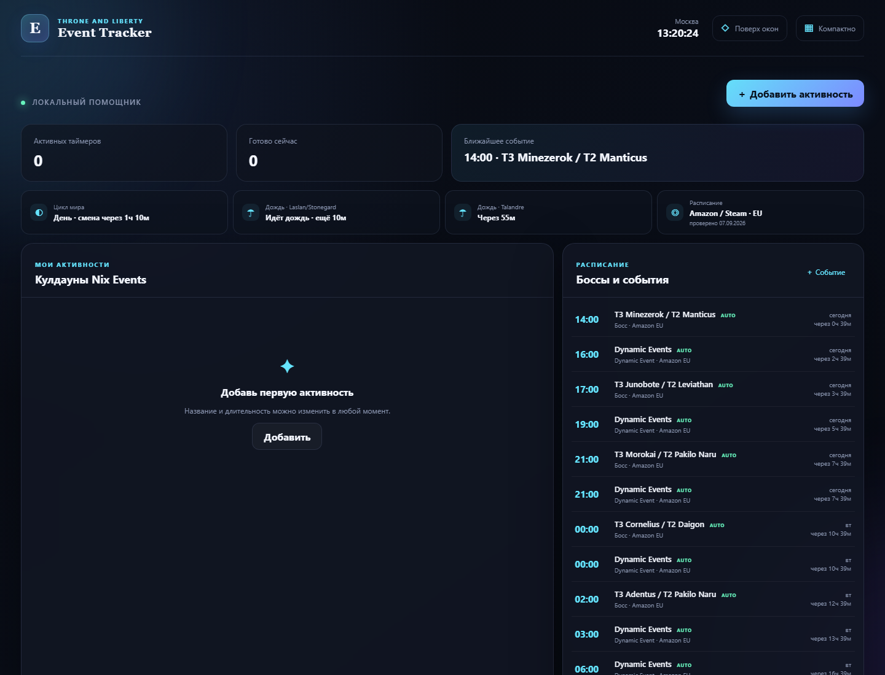

# Nix Tracker

Локальный таймер активностей и событий для Throne and Liberty: Nix.



## Возможности

- пользовательские кулдауны с кнопкой «Пройдено»;
- системные уведомления;
- редактируемое расписание боссов и событий;
- автоматическая EU-ротация T2/T3-боссов Amazon/Steam;
- автоматический прогноз дождя и цикла день/ночь;
- история прохождений;
- компактный режим и окно поверх игры;
- локальное хранение данных без подключения к игровому клиенту.

## Запуск

```powershell
npm install
npm start
```

## Windows-сборка

```powershell
npm run dist
```

Готовые файлы появятся в папке `release`.

- `Nix-Tracker-Setup-<version>-x64.exe` — установщик;
- `Nix-Tracker-Portable-<version>-x64.exe` — запуск без установки.

Удаление активности или события доступно в форме редактирования по кнопке `•••`.

Приложение не читает память игры, не перехватывает сетевой трафик и не отправляет игровые команды.

## Данные расписания

Автоматический календарь предназначен для Amazon/Steam EU. Ротация и погодные циклы проверены 7 сентября 2026 года по публичному календарю Questlog и официальным сообщениям Amazon Games. После изменений расписания в патчах таблицу необходимо обновлять.
